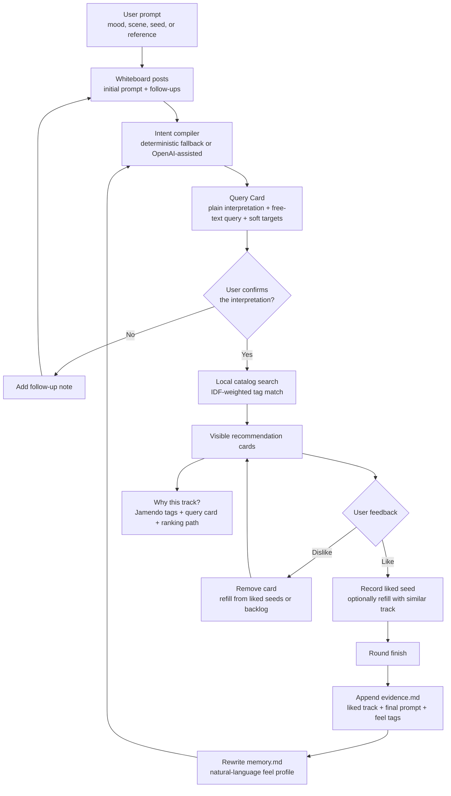
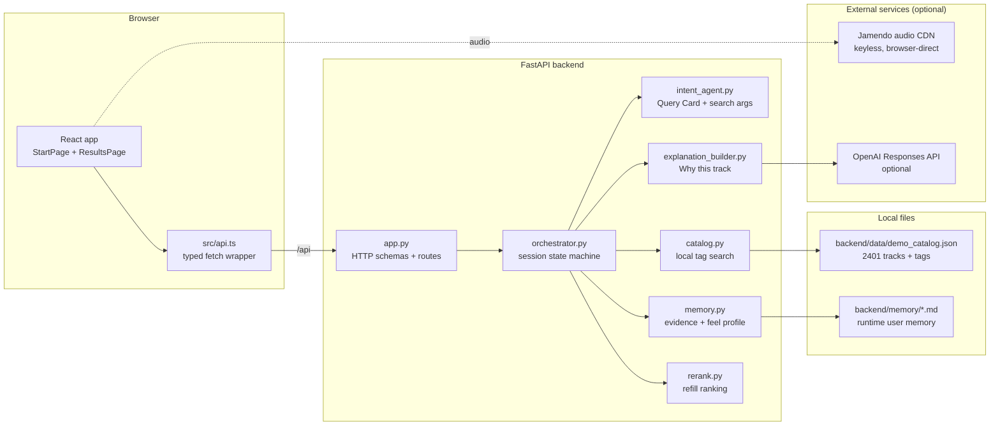

<div align="center">

# Sounds Like You

**An audio-first music discovery demo, built at HACKATUNE 2026 and kept running since**

Turn a listener's messy natural-language mood into explainable recommendations,
grounded in an offline audio-tag catalog and refined through lightweight taste memory.

[](backend/README.md)
[](frontend/README.md)
[](backend/pyproject.toml)
[](LICENSE)

[Origin & credits](#-origin-and-credit-where-it-is-due) · [How it works](#-how-it-works) · [Architecture](#-architecture) · [Dependencies](#-dependencies) · [Run](#-run-locally) · [API](#-api-surface) · [Verification](#-verification)

</div>

---

## 🏛️ Origin, and credit where it is due

This project was built at **[HACKATUNE 2026](https://munichmusiclabs.com/events/hackatune-2026/)**
(Munich Music Labs × Cyanite, Munich, 26–28 June 2026) — see also the
[TUM event page](https://www.tum.de/en/news-and-events/events/details/hackatune-2026-by-munich-music-labs).
Cyanite set the challenge: build audio-first, explainable music discovery on their
Search and Tagging API.

**Almost everything that makes this app interesting was built by the original team over that
weekend** — the confirmation gate, the like/dislike refill loop, the markdown taste-memory model,
the "Why this track?" explanation system, and the whole FastAPI orchestration behind them.

Original team, from the commit history of
[`Hurwitzzz/resonat_hackatune`](https://github.com/Hurwitzzz/resonat_hackatune) (89 commits):

- **[@Hurwitzzz](https://github.com/Hurwitzzz)** — Hewei Gao
- **[@CAgGen](https://github.com/CAgGen)**
- **[@baobaihong](https://github.com/baobaihong)** — Baihong Bao
- **[@johanna0626](https://github.com/johanna0626)** — Yihao Wang

The design system and UI mockups the frontend is built on came from a parallel repository by
**[@FayeFang-creator](https://github.com/FayeFang-creator)** during the same event.

That repository remains the record of the original work. **This one is a continuation, not a
replacement** — if you want to see what the team shipped at the hackathon, look there.

### Why this repository exists

After the event, the sponsor API was switched off — Cyanite's search and similarity endpoints
now return 404 and the issued key returns 401 — so the hackathon build stopped working: enter a
prompt, and the page dead-ends on an error. This repository exists to carry the project forward:

1. **Keep it runnable.** Search is re-implemented against a local, self-contained catalog of
   public Jamendo metadata, so the demo runs with **no API key and no external dependency** and
   will not rot when someone else's service goes away. See
   [Data and API notes](#-data-and-api-notes) for exactly what was traded away — this is tag
   matching, not the audio-semantic search Cyanite provided.
2. **Refine the frontend and the interaction design,** which is the ongoing work here.

No hackathon-provided dataset or Cyanite model output is included in this repository; per the
challenge agreement those may not be redistributed. The retrieval here does not need them.

---

## ✨ What is this?

Cochlea, also described in the product as **Sounds Like You**, is a hackathon music
recommendation app built around one principle: the user should understand why a
song was recommended.

The app takes a vague prompt such as "lonely midnight train ride", compiles it into
a visible Query Card, asks the user to confirm or refine that interpretation, then
searches a local Jamendo-derived catalog. User feedback updates an in-session seed set and,
when the round is finished, appends evidence to markdown-based taste memory.

This repository currently contains:

| Content | Description |
|---|---|
| [`frontend/`](frontend/) | React + TypeScript + Vite experience for prompt input, results, feedback, explanations, and "sounds like you" cards |
| [`backend/`](backend/) | FastAPI service that owns sessions, intent compilation, catalog search, explanations, and markdown memory |
| [`backend/data/`](backend/data/) | `demo_catalog.json` — 2401 首 Jamendo 曲的公开元数据（CC BY-SA），检索的唯一数据源 |
| [`PRD-night.md`](PRD-night.md) | One-night sprint PRD that defines the confirmation gate, feedback loop, and no-database memory model |
| [`GETTING_STARTED.md`](GETTING_STARTED.md) | Chinese setup guide used by the team during development |

---

## 🧭 How it works



The recommendation loop is intentionally small:

| Step | What happens |
|---|---|
| **Intent** | `/intent` stores the first prompt as a whiteboard post and compiles a Query Card without searching yet |
| **Refine** | `/intent/follow-up` adds another post and recompiles the Query Card |
| **Confirm** | `/intent/confirm` runs the local catalog search only after the user accepts the interpretation |
| **Feedback** | `/feedback` records likes as seeds, removes disliked cards, and refills empty slots |
| **Memory** | `/round/finish` appends evidence and rewrites a feel-only profile in markdown |
| **Explain** | `/explain` builds an English explanation from the track's tags, the Query Card, user memory, and ranking metadata |

---

## 🏗️ Architecture



Session state lives in memory inside the backend process. Cross-session taste memory is
stored as two markdown files per user under `backend/memory/`; there is no database.

---

## 📁 Project structure

```text
.
├── backend/
│   ├── app.py                 # FastAPI routes and request/response contracts
│   ├── orchestrator.py        # prompt -> search -> feedback -> memory loop
│   ├── catalog.py             # 本地曲库检索（取代已下线的 Cyanite）
│   ├── intent_agent.py        # Query Card and search-argument generation
│   ├── explanation_builder.py # grounded English recommendation explanations
│   ├── memory.py              # markdown evidence/profile storage
│   ├── rerank.py              # refill candidate ranking helpers
│   ├── build_catalog.py       # 构建期：从公开 Jamendo API 抓曲库（跑一次）
│   └── data/demo_catalog.json # 检索用的本地曲库
│   └── test_*.py              # focused backend tests
├── frontend/
│   ├── src/App.tsx            # route shell
│   ├── src/pages/             # start and results flows
│   ├── src/components/        # cards, controls, modal, visual effects
│   └── src/api.ts             # typed API client for the FastAPI backend
├── start.sh                   # one-shot full-stack dev startup
├── dev.sh                     # smaller backend/frontend startup helper
├── serve.py                   # 线上入口：同源站同时供前端与 /api
├── Dockerfile                 # 单镜像部署（HF Spaces / 任意容器平台）
└── .env.sample                # optional keys template
```

---

## 📦 Dependencies

| Layer | Runtime / package manager | Main dependencies |
|---|---|---|
| **Backend** | Python 3.13 + [`uv`](https://docs.astral.sh/uv/) | FastAPI, Uvicorn, Requests, HTTPX, python-dotenv, pytest |
| **Frontend** | Node.js 20+ + npm | React 19, React DOM, React Router, Vite, TypeScript, Tailwind CSS, motion, OGL, oxlint |
| **Data** | Local JSON | `backend/data/demo_catalog.json`（公开 Jamendo 元数据，CC BY-SA）|
| **External APIs** | HTTP | 运行时无必需外部 API；可选 Jamendo 下载代理、可选 OpenAI Responses API |
| **Memory** | Markdown files | `backend/memory/<user_id>.evidence.md` and `backend/memory/<user_id>.memory.md` generated at runtime |

Backend dependency versions are locked by [`backend/uv.lock`](backend/uv.lock).
Frontend dependency versions are locked by [`frontend/package-lock.json`](frontend/package-lock.json).

---

## ⚙️ Configuration

**演示不需要任何密钥。** 直接跑就行；下面这些全是可选增强：

| Variable | Required? | Purpose |
|---|---:|---|
| `OPENAI_API_KEY` | Optional | 开启 LLM 版意图解读与推荐解释；不填走确定性兜底（功能完整，文案更朴素）|
| `OPENAI_MODEL` / `OPENAI_BASE_URL` / `OPENAI_TIMEOUT` | Optional | 见 [`backend/config.py`](backend/config.py) |
| `JAMENDO_CLIENT_ID` | Optional | 开启高音质下载代理；重建曲库（`build_catalog.py`）时必填。这是**公开**标识符而非密钥，可直接作为部署平台的普通环境变量 |

不填 `JAMENDO_CLIENT_ID` 时下载按钮返回 503，其余功能不受影响。
`.env` 已被 git 忽略，由 [`backend/config.py`](backend/config.py) 从仓库根加载。

## 🚀 Run locally

Install the base tools first:

```bash
uv --version
node --version
npm --version
```

One command starts the whole app:

```bash
./start.sh
```

It syncs backend dependencies, installs frontend dependencies, starts FastAPI on
`:8000`, and starts Vite on `:5173`.

| URL | What it is |
|---|---|
| http://localhost:5173 | Frontend app |
| http://localhost:8000 | Backend API |
| http://localhost:8000/docs | FastAPI Swagger UI |

Smaller commands are available through [`dev.sh`](dev.sh):

```bash
./dev.sh          # sync backend dependencies only
./dev.sh run      # run FastAPI on :8000
./dev.sh front    # run Vite on :5173
```

Manual equivalents:

```bash
# Backend
cd backend
uv sync
uv run uvicorn app:app --reload --port 8000
```

```bash
# Frontend
cd frontend
npm install
npm run dev
```

### 像线上一样跑（单源站，无 Vite）

```bash
cd frontend && npm run build && cd .. && uv run --project backend uvicorn serve:root --port 7860
```

打开 http://localhost:7860 —— 前端与 `/api` 同源，和部署后的形态一致。

### 部署

[`Dockerfile`](Dockerfile) 打成单镜像（前端构建 + 后端 + 本地曲库），监听 `7860`，
直接对应 Hugging Face Spaces 的 Docker SDK；任意容器平台同样可跑。

```bash
docker build -t sounds-like-you . && docker run -p 7860:7860 sounds-like-you
```

**不需要配置任何 secret。** 想开启高音质下载，把 `JAMENDO_CLIENT_ID` 加成普通环境变量即可
（它是公开标识符，不是密钥）。

---

## 🔌 API surface

| Endpoint | Purpose |
|---|---|
| `GET /health` | Lightweight backend health check |
| `POST /intent` | Start a session and compile the first Query Card |
| `POST /intent/follow-up` | Add a follow-up note and recompile the Query Card |
| `POST /intent/confirm` | Run the confirmed catalog search and return cards |
| `POST /feedback` | Apply like/dislike feedback and refill the visible list |
| `POST /round/finish` | Persist liked evidence and rewrite the user feel profile |
| `POST /explain` | Generate "Why this track?" for a visible recommendation |
| `GET /your-sound` | Return the user's markdown feel profile |
| `GET /sounds-like-you` | Search for tracks that match the long-term profile |
| `POST /explain-sounds-like-you` | Explain a profile-based track |
| `GET /download/{track_id}` | Proxy a Jamendo MP3 download (needs `JAMENDO_CLIENT_ID`) |

开发时前端经 Vite 的 `/api` 代理访问这些路由；线上由 [`serve.py`](serve.py) 把后端挂在
同一源站的 `/api` 下，所以浏览器代码始终用相对路径如 `/api/intent`。

## 🧪 Verification

后端测试完全离线（检索本来就不打网络，LLM 接缝被 monkeypatch）：

```bash
cd backend
uv run pytest
```

Frontend checks:

```bash
cd frontend
npm run build
npm run lint
```

Basic runtime smoke checks:

```bash
./start.sh
curl localhost:8000/health
```

Expected health response:

```json
{"ok":true}
```

检索层单独自检（不打网络）：

```bash
cd backend && uv run python catalog.py
```

端到端：打开 `http://localhost:5173`，输入 prompt，确认 Query Card，然后 like/dislike
并打开 "Why this track?"。换两个语义差别大的 prompt（如 `lonely midnight train ride`
与 `sunny morning workout energy`），结果应当明显不同。

---

## 🎧 Data and API notes

> **赛后状态（2026-09）**：Cyanite 的 `private-alpha` 检索/相似端点已下线（404），
> API key 已吊销（401）。检索层因此换成仓库内的本地曲库，**不再需要任何 API key**。

| Id | Meaning |
|---|---|
| `track_id` | Jamendo numeric track id — 音频、展示、下载都用它 |
| `cyanite_id` | 历史字段名，现在**等于** `track_id`（双 id 体系已取消，前端契约不变）|

检索全部在 [`backend/catalog.py`](backend/catalog.py) 内完成，零网络：

| 原 Cyanite 能力 | 现在的实现 |
|---|---|
| Text prompt search | `search_by_prompt()` — IDF 加权标签/词面匹配 + 速度档位 |
| Single-seed similarity | `find_similar()` — 种子标签的 IDF 加权近邻 |
| Multi-seed similarity | `find_similar_multi()` — 多种子标签并集 |
| Model outputs / tags | `model_tags()` — Jamendo `musicinfo`（genre / mood / instruments / speed / vocals）|

曲库 `backend/data/demo_catalog.json`（2401 首）由
[`backend/build_catalog.py`](backend/build_catalog.py) 一次性从公开 Jamendo API 抓取，
只有构建期需要 `JAMENDO_CLIENT_ID`。音频由 Jamendo 公开 CDN 直供浏览器，无需 key。

**这是词面匹配，不是音频语义检索** —— 这是公开数据能做到的诚实上限。要恢复真正的语义
检索，下一步是用 [JamendoMaxCaps](https://huggingface.co/datasets/amaai-lab/JamendoMaxCaps)
的 `final_caption30sec.jsonl`（CC BY-SA 3.0，主键就是 Jamendo track id）建本地 caption
向量索引；`catalog.py` 的对外接口无需改动。

## 🧹 Maintenance

Do not commit local runtime state:

| Path | Why |
|---|---|
| `.env` | Local API keys（演示本身不需要）|
| `backend/.venv/` | Local Python environment |
| `frontend/node_modules/` | Local npm install |
| `backend/memory/*.md` | Runtime user memory |
| Build caches | Generated artifacts |

Recommended pre-commit checks:

```bash
cd backend && uv run pytest
cd ../frontend && npm run build
git status --short
```

---

## Terms and licenses

- Challenge brief: [`CHALLENGE.md`](CHALLENGE.md)
- Challenge agreement: [`CHALLENGE_AGREEMENT.md`](CHALLENGE_AGREEMENT.md)
- Code and docs: MIT, see [`LICENSE`](LICENSE)
- Data pack terms: [`DATA_LICENSE.md`](DATA_LICENSE.md)

<div align="center">

Built by the original team at **[HACKATUNE 2026](https://munichmusiclabs.com/events/hackatune-2026/)**
(Munich Music Labs × Cyanite) · continued here

</div>
